# CS301: IT SOLUTION ARCHITECTURE PROJECT

For this project, our team is tasked with designing a solution architecture that will demonstrate the design and implementation of software patterns, architecture styles and achieve availability, security and performance qualities.
We have chosen to develop a Student Management Systems (SMS) web application for this project to showcase our solution architecture. 

**Please note that the current set of applications are tailored to run on the AWS cloud, therefore it would not build properly on a local machine unless you set up the necessary components on AWS and change the endpoints in the source code to the allocated url.**

## Motivation
SMS comprises of mainly three stakeholders: Students, Teachers and Administrators. The system can be used for many different purposes - paying school fees, checking their enrolled classes or taking attendance etc. As SMS contains confidential information like payment details, users must be authenticated to use it. As SMS provides students, teachers and administrators with multiple key educational and administrative functionalities, its services need to be fast, well-performing and available 24/7. This holds especially true during peak periods such as checking of examination results, and periods nearing payment deadlines. Hence, SMS is a suitable application that can allow us to design a good solution architecture
 
## Solution overview diagram:
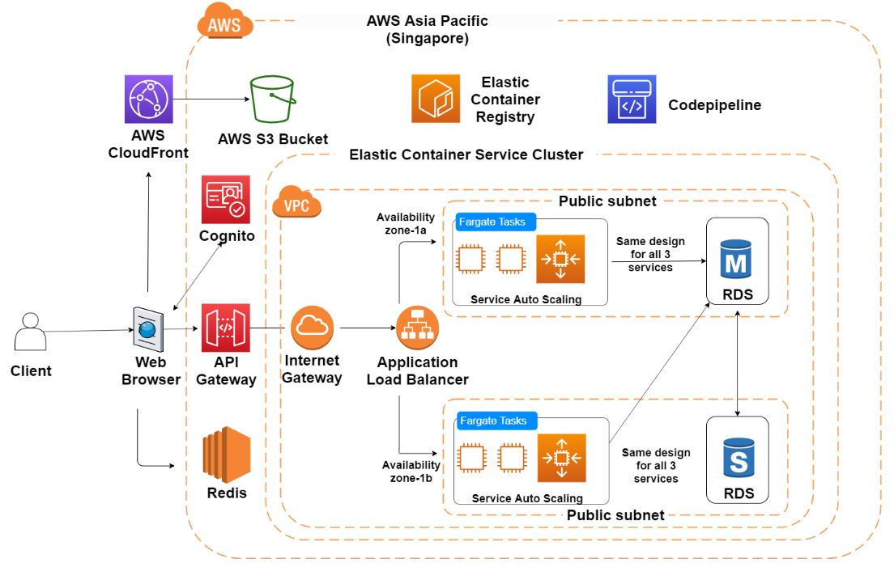

The diagram showcases our whole infrastructure architectural design. 

User flow:
- Students access the SMS web application by retrieving the Angular application’s link from AWS CloudFront at specific deployed url [url]
- The Angular app that lives in the browser will interact with the services ( Module, Payment, Student) through the API Gateway.
- The API Gateway communicates with the Application Load Balancer which will then route the requests to the relevant microservices running on ECS fargate.
- The Angular app may also interface with our authentication module, Cognito, as well as with Redis to retrieve specific information required for the usage of the app.
- In the initial set up, ECS fargate has already deployed the microservices as containerized applications on AWS cloud.
- The microservices described as Fargate Tasks will then interact with the RDS (Relational Database Service) . 
 
## Development process diagram:
### CI/CD
To update the existing microservices, the operations to be performed manually are as follows:
- Develop code and run Unit/Regression Test locally
- Push the changes to the feature branch 
- Create pull request for the feature branch into the develop branch 
- Merge pull request

A clear illustration of the Development process flow are shown in the following diagrams

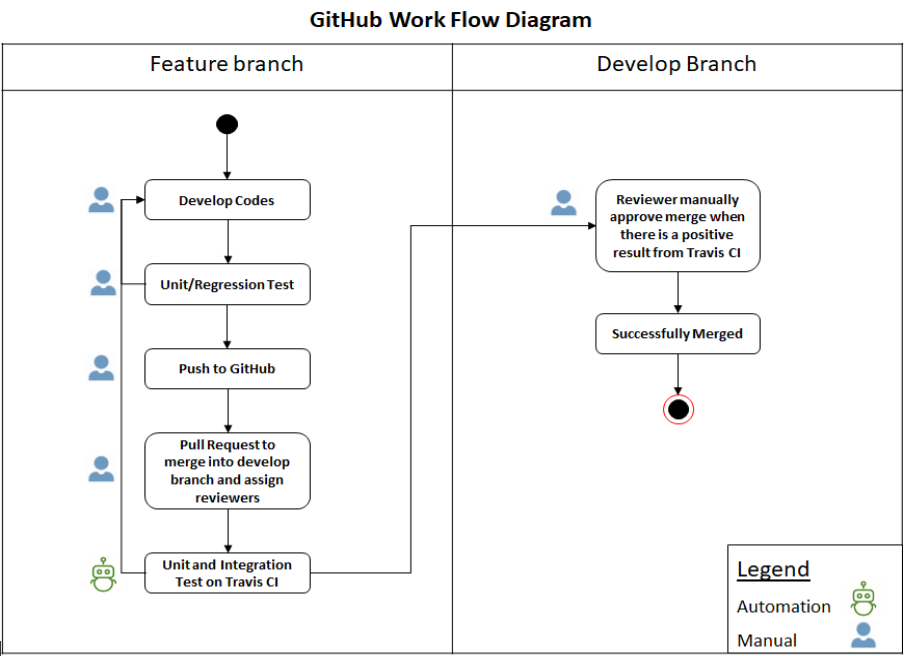

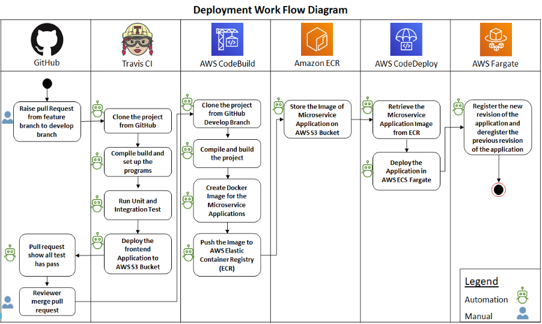


The Travis CI executed the following command in the .travis.yml file. Notice here this command only work on develop branch. Thus, any merge request to any other branch will not trigger this travis build. 

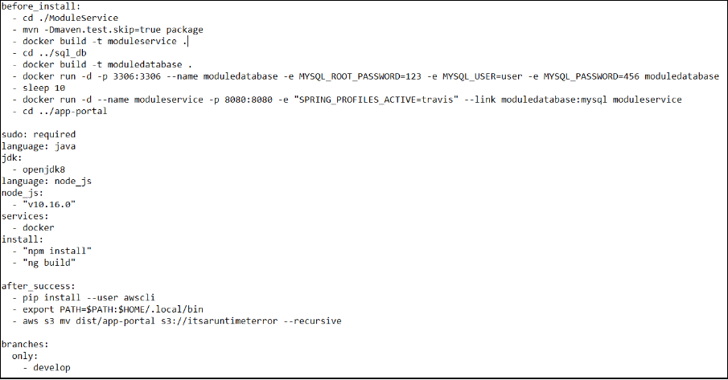

The AWS CodeBuild executes based on the following buildspec.yaml file which is uploaded onto the AWS account during the configuration. 
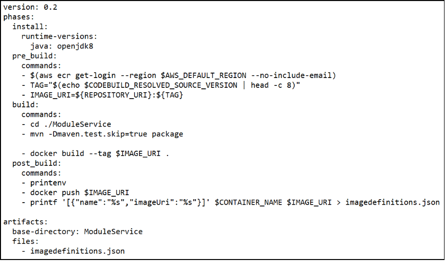

## Maintainability:

### Design patterns
- Builder pattern for PayPal API Payment object - Builder interface with PayPalPayment as director to build the object
- Facade pattern for API Gateway - abstracts and encapsulates microservices, increasing modifiability, maintainability

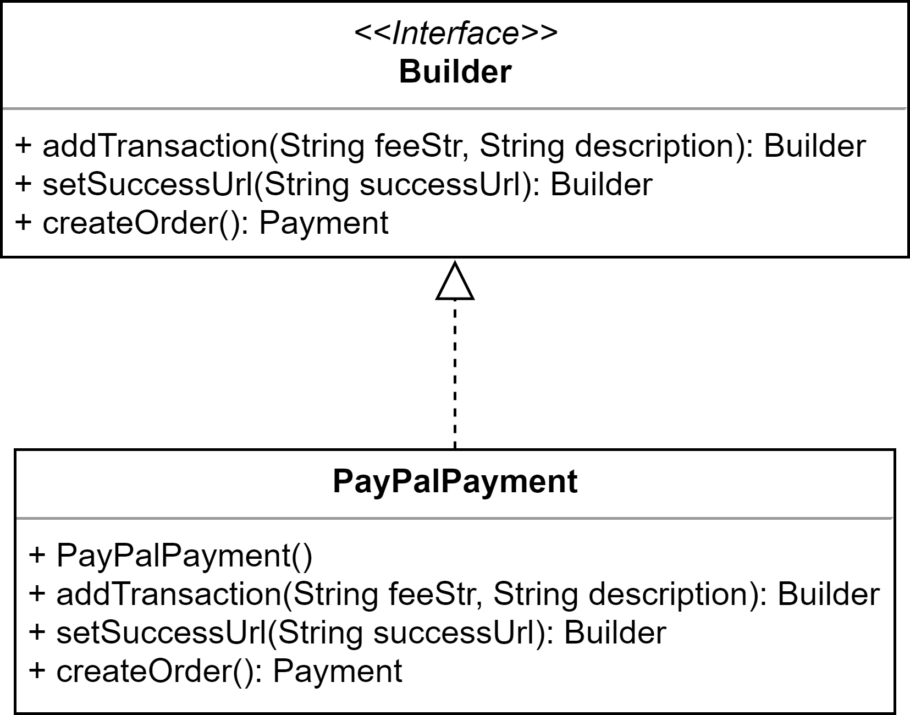

### Microservice architecture
- Modular microservices that is independent of each other increases simplicity yet not compromising functionality
- Microservices are highly maintainable, portable, testing in isolation is easier for larger systems
- Loosely coupled, independently deployable, allow teams to work on modules independently, ease of coordination

### Containerization - AWS Fargate
- Container orchestration service allows microservices to run seamlessly. Easy provisioning and scaling of microservices clusters
- AWS Container Cluster Management used as it is well integrated and suited for our AWS architecture
- Easily configure CPU, memory requirements, security policies, scaling requirements.

### Implementing an API Gateway
- A single point of entry, to hide microservices. Provide a high level, unified, client facing interface
- Abstracts and encapsulates microservices, increasing modifiability, maintainability

### Dedicated User Management/Authentication Service
- AWS Cognito provides great customization, easy integration with AWS infrastructure

### Database as a Service
- Cost effective way to provision database for different clients, DBaaS is a scalable and efficient way of database provisioning
- Setup of database availability and redundancy is easier with a DBaaS
- Compute power and capacity can be scaled dynamically, saving costs in the long run
 
## Availability:

### AWS Load Balancer
- Direct network traffic to microservices cluster, perform failover duties, thus ensuring high availability
- https://docs.aws.amazon.com/elasticloadbalancing/latest/userguide/how-elastic-load-balancing-works.html

### Failover demo:
- 1) We will visit the aws load balancer url to invoke the student service get IP address end-point. This should return more than 1 different IP addresses upon multiple visits. This proves that the load balancer is distributing requests across active-active redundancies. Take note that the load balancer url will be decided by the domain name given in AWS. For eg. for our demo we used the url "http://itsa-sms-lb-1364654292.ap-southeast-1.elb.amazonaws.com/api/student/getIP" 
- 2) Then we will shut down one of the redundancy. This will lead to one RUNNING service, another on PROVISIONING. PROVISIONING because ECS fargate will automatically spawn another service instance up upon detecting failure.

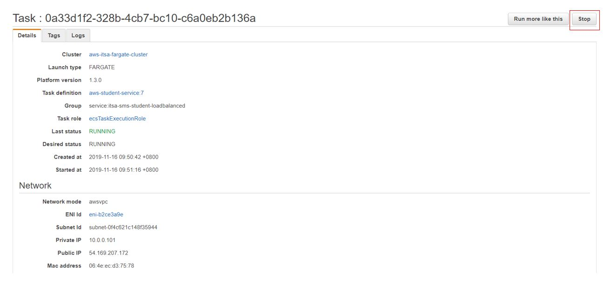


- Then, we will visit the link again to verify that only one IP address is being responded. This means failover has taken place successfully where load balancer only hits the working service.
- Refer to the sequence diagram below for failover flow

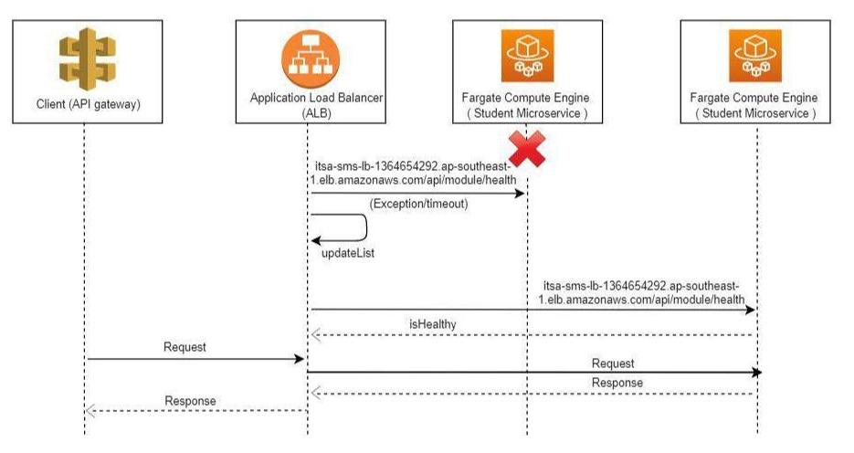
    
### AWS RDS Multi-AZ failover
- https://docs.aws.amazon.com/AmazonRDS/latest/UserGuide/Concepts.MultiAZ.html
- One way database replication, fail-over management is ensured, slave takes over master in event of failure
- Less complication when it comes to sync-ing
- Shown below is a bash script to continuously ping our database to show the database failover process. The point where the ip address changes is where the failover process takes place. After the failover process, the Region & AZ changes automatically from ap-southeast-1a to ap-southeast-1b.


- Refer to below for sequence diagram of RDS failover

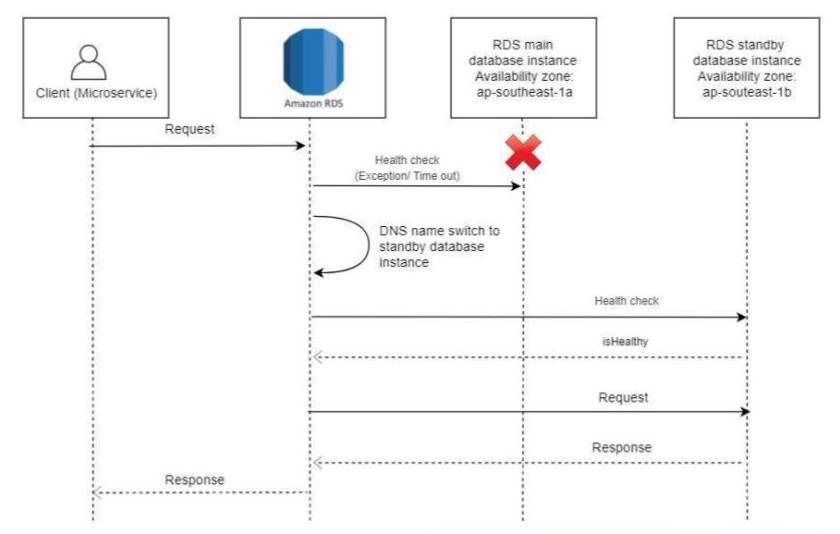

### AWS ECS Fargate auto-scaling feature:
- Automatically adjust number of microservices deployed based on number of incoming requests
- Easily manage availability issues, especially when network traffic is high

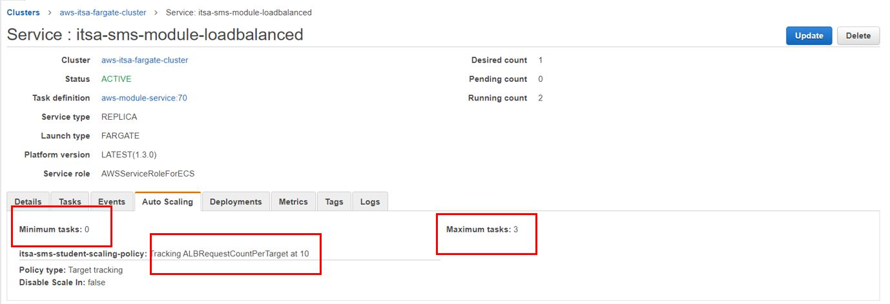

- For the SMS, our services will be auto-scaled according to number of requests entering the load balancer towards the service. We have set the scaling policy to raise an instance per 10 request.
- https://docs.aws.amazon.com/AmazonECS/latest/developerguide/service-auto-scaling.html

### S3 Bucket + CloudFront CDN
- According to AWS, durability for S3 is guaranteed at 99.999999999%.

## Performance:

### AWS Load Balancer
- Horizontally scaling allows dynamism, possibility of scaling up/down based on needs, saving costs, introducing scalability and flexibility
- Resources across same service utilized efficiently, many instances of the same service can service incoming network requests  
- Refer to the diagram below for the demonstration of load balancing 50 incoming request over a single instance and multiple instances. We can see that performance for the - single instance is slower than the one for multiple instances.
 


### Redis cache
- Reduce hits on the database, improve speed of page loads
- As an in-memory database, Redis provides incredibly fast read and write speeds as compared to normal databases


- Refer to /app/app-portal/src/app/class-list/class-list.component.ts from line 29-76 for the implementation.

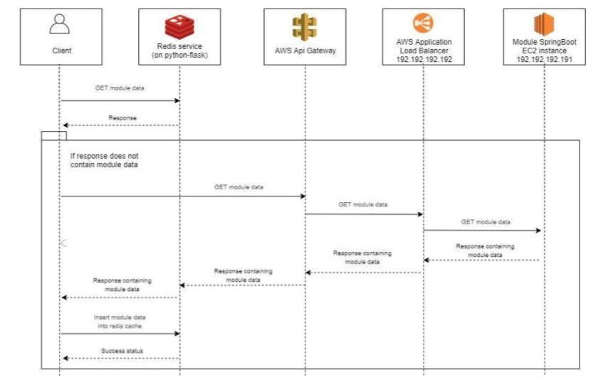

### Autoscaling with AWS Fargate
- Automatically adjust desired number of microservices, spawn multiple instance of a particular service based on number of incoming requests
 
### Pre-fetch
 - Reduce load time between pages
- Faster load time for commonly used functions such as take attendance and view classes
    


- Pre-fetch attendance details when the user reaches classlist page:
- Make an HTTP request to get attendance
- Store the pre-fetched data in local storage
- Refer to /app/app-portal/src/app/class-list/class-list.component.ts from line 25-27 for the implementation.
- Refer to the sequence diagram to better understand pre-fetch flow

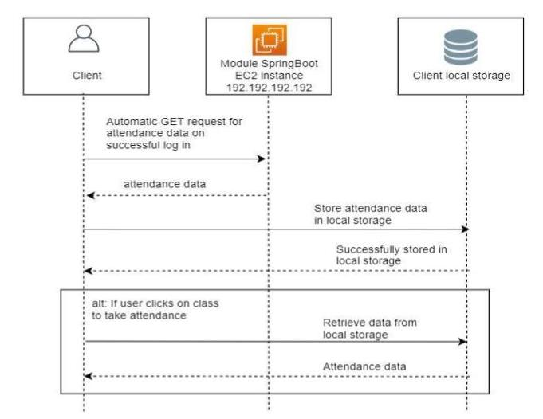
    
## Security:
- X-Content-Type Options Header Missing fixed with Spring Security package with csrf.disable()
- More about Spring Security: https://spring.io/guides/topicals/spring-security-architecture


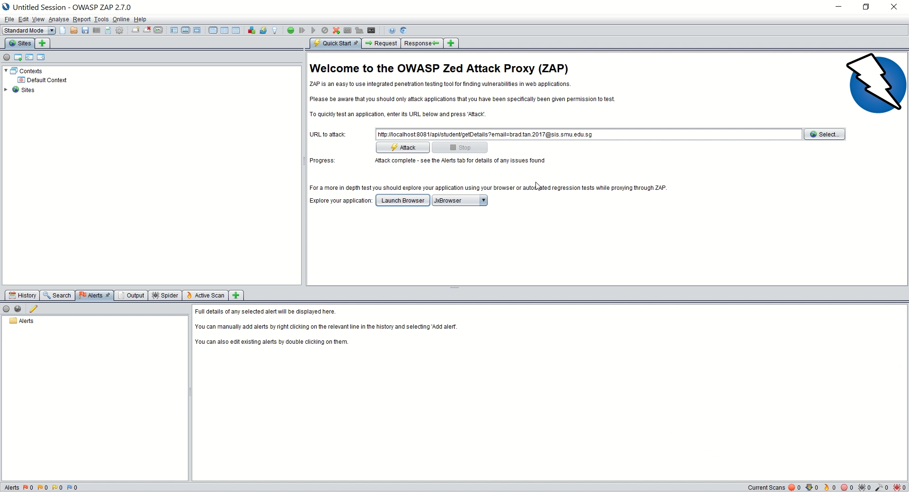

- Prevent unauthorised URL access by logged in user mitigated with AuthGuard in Angular 7
- Prevent unauthorised access to microservices mitigated with JWT token upon login (generated by AWS Cognito) and validated (by AWS API Gateway) whenever a request is made
- Payments made via PayPal are validated before database is updated
- Security group on AWS

### Implementing an API Gateway
- Security ensured through HTTPS, well integrated with other AWS components, User Access configurations; restriction of access to different roles

### Dedicated User Management/Authentication Service
- Supports Multi Factor Authentication, common security implementation in today’s age
- Role based access, easily configurable Single-Sign-On feature integration with the commonly used platforms, including Facebook and Google

### S3 Bucket + CloudFront CDN
- This setup allows for SSL encryption, DDOS mitigation

### PayPal Integration
- Established third party that can handle payments for an entity
- https://developer.paypal.com/docs/api/quickstart/create-process-order/


 
# Getting Started - Setting Up

## Run the following components locally:

### Frontend
```
Navigate to the frontend app
cd app/app-portal
Install node modules dependencies
-npm install
Run the Angular application
ng serve
```

### Redis service

- Downloading and running redis:
```
- For Windows users: download redis from https://github.com/dmajkic/redis/downloads
- navigate to the redis directory
- cd into the "32bit" or "64bit" directory based on your system
- input "redis-server"
- open another instance of cmd/terminal
- input "redis-cli"
- the redis-cli should appear
- For MAC users: https://redis.io/topics/quickstart
```

- Quickstart at using redis-cli
```
- input "keys *" to see all current keys
- input "set {key} {value}" to assign a new key to a new value
- input "get {key}" to retrieve the value assigned to the key
```

- Running the python-flask microservice
```
- cd into app/redis-service
- pip install flask flask_cors python-dotenv redis
- py app.py
- the redis-service app will run locally on port 5000
- input "localhost:5000" to access the application
Refer to the API Documentation below for the API details.
``` 

## For the following components, you need to set up on AWS:

### Authentication (AWS Cognito)
- https://docs.aws.amazon.com/cognito/latest/developerguide/cognito-getting-started.html 

### Load Balancer
- https://docs.aws.amazon.com/elasticloadbalancing/latest/application/introduction.html
- Once you set up the load balancer and have the url, connect API gateway to load balancer.

### API GATEWAY (AWS)
- https://docs.aws.amazon.com/apigateway/latest/developerguide/welcome.html
- Set up api gateway, link the gateway to aws load balancer
- Connect angular application to api gateway when communicating with the backend services

### Module, Payment and Student services on AWS ECS Fargate
- AWS ECS Fargate: https://docs.aws.amazon.com/AmazonECS/latest/developerguide/service-auto-scaling.html
- Microservices are in ModuleService, PaymentService and StudentService folders
- Individual setup instructions for each service are found below to access each endpoint; refer to README.md for more details of each module, including setup and API documentation. This setup works if you want to interact with the services at localhost with their respective ports.
- If you want to test the services on AWS CLOUD, you will have to set up all the AWS components yourself and run the services on AWS ECS Fargate. If you do so, communicating with the services will be done through the api gateway url.
 
### AWS RDS for databases of Module, Payment and Student services
- RDS setup guide: https://aws.amazon.com/rds/
- Set up 3 AWS RDS instances with Multi-AZ
- Run the create.sql and insert.sql scripts in app/sql_db/module, app/sql_db/payment and app/sql_db/student respectively in the 3 RDS instances

### UI Screenshots
Login page

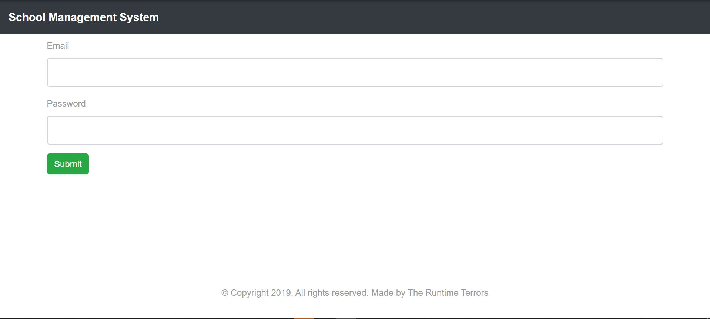

```
Email: jake.tan.2017@sis.smu.edu.sg
Password: Test1234!
```

Home page

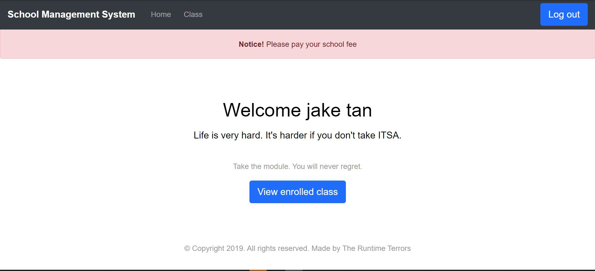

Module page

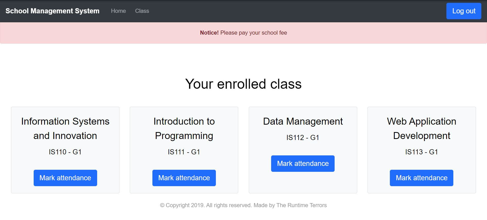

Attendance taking page

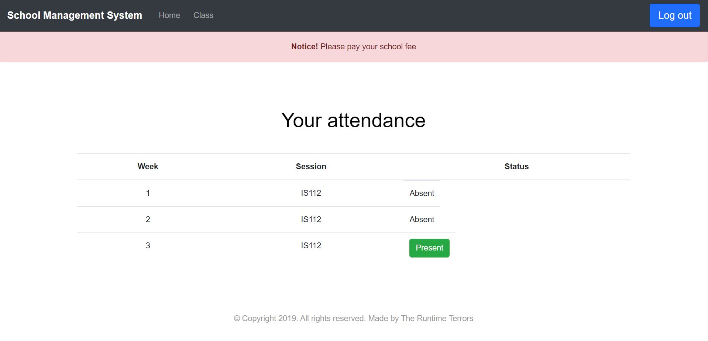

Payment page


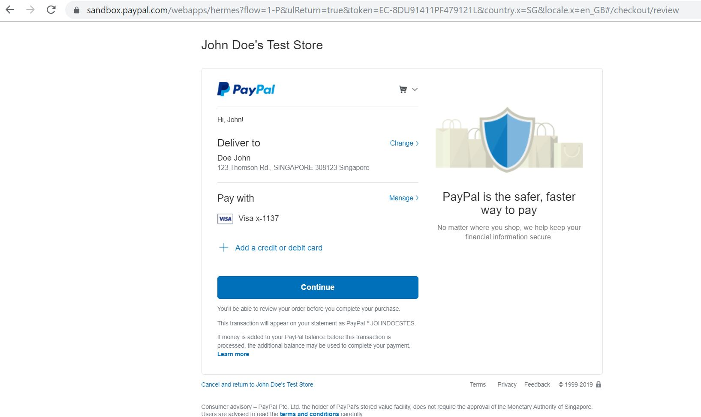
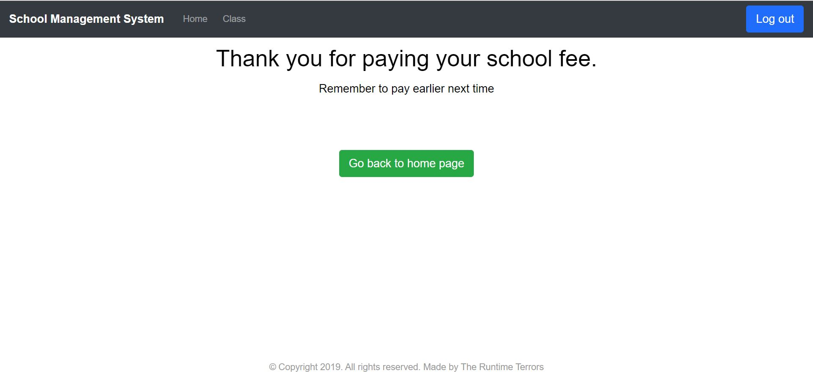

# API Documentation
 
## Module Service
 
cd into app/ModuleService
type "mvn spring-boot:run"
access this locally on port 8080
 
### Get Attendance
Allows student to retrieve attendance for a particular module.
 
Endpoint: `api/module/getAttendance`
 
Parameters:
- `student_id`
- `module_id`
 
Sample request: `api/module/getAttendance?module_id=IS110&student_id=1`
 
Sample response:
```
{
  "status": 200,
  "value": [
              {"present": true, "moduleId": "IS110", "weekId": 1, "studentId": 1},
              {"present": false, "moduleId": "IS110", "weekId": 2, "studentId": 1},
              {"present": false, "moduleId": "IS110", "weekId": 3, "studentId": 1}
           ]
}
```
 
### Take (Update) Attendance
Allows student to take attendance for a particular module at a particular week.
 
Endpoint: `api/module/updateAttendance`
 
Parameters:
- `student_id`
- `module_id`
- `week_id`
 
Sample request: `api/module/updateAttendance?module_id=IS110&student_id=1&week_id=1`
 
Sample response:
```
{
  "status": 200,
  "rows_updated": 1
}
```
 
### Get Modules
Retrieves modules of a student.
 
Endpoint: `api/module/getModules`
 
Parameters:
- `student_id`
 
Sample request: `api/module/getModules?student_id=1`
 
Sample response:
```
{
  "status": 200,
  "value":[
            {"module_id": "IS110", "module_name": "Information Systems and Innovation", "section_id": "G1"}, 
            {"module_id": "IS111", "module_name": "Introduction to programming", "section_id": "G1"}, 
            {"module_id": "IS112", "module_name": "Data Management", "section_id": "G1"},
            {"module_id": "IS113", "module_name": "Web Application Development", "section_id": "G1"}
          ]
}
```
 
### Get Results
Retrieves student's results.
 
Endpoint: `api/module/getResults`
 
Parameters:
- `student_id`
 
Sample request: `api/module/getResults?id=1`
 
Sample response:
```
{
  status: 200,
  value: [
            {result: "A+", module_id: "IS110"}, 
            {result: "B+", module_id: "IS111"}
         ]
}
```
 
### Get Students
Retrieves student's class list of a particular module.
 
Endpoint: `api/module/getClasslist`
 
Parameters:
- `student_id`
- `module_id`
 
Sample request: `api/module/getClasslist?student_id=1&module_id=IS110`
 
Sample response:
```
{
  "status": 200, 
  "value": [1, 2, 3]
}
```
 
## Student Service
 
cd into app/StudentService
type "mvn spring-boot:run"
access this locally on port 8081
 
### Get Details
Get student's details from their email.
 
Endpoint: `api/student/getDetails`
 
Parameters:
- `email`
 
Sample request: `api/student/getDetails?email=brad.tan.2017@sis.smu.edu.sg`
 
Sample response:
```
{
  "status": 200, 
  "value": {
    "studentId": 4, 
    "name": "brad tan", 
    "email": "brad.tan.2017@sis.smu.edu.sg", 
    "studentType": "foreigner"
  }
}
```
 
### Get Students
Gets students' information based on their ids.
 
Endpoint: `api/student/getStudents`
 
Parameters:
- `ids`: List of student ids, separated by commas `,`
 
Sample request: `api/student/getStudents?ids=1,2`
 
Sample response:
```
{
  "status": 200, 
  "value": [
              {"studentId": 1, "name": "bob tan", "email": "bob.tan.2017@sis.smu.edu.sg", "studentType": "singaporean"}, 
              {"studentId": 2, "name": "jake tan", "email": "jake.tan.2017@sis.smu.edu.sg", "studentType": "singaporean"}
            ]
}
```
 
## Payment Service
 
cd into app/PaymentService
type "mvn spring-boot:run"
access this locally on port 8082
 
**Process Flow**
1. Check if student has paid from `api/payment/getPaymentStatus`
2. Get payment amount from `api/payment/getAmount`
3. Call `api/pay`
4. Get the `token`, `paymentId` and `payerId` parameters from the `successUrl`, then add `studentId`, `semester`, `annualYear` and `amount` and pass to backend
`api/paymentsuccess`
 
### Get Payment Status
Gets the payment status of student.
 
Endpoint: `api/payment/getPaymentStatus`
 
Parameters:
- `studentId`
 
Sample request: `api/payment/getPaymentStatus?studentId=2`
 
Sample response:
```
{
  "status": 200, 
  "value": {
    "studentId": 1, 
    "annualYear": 2019, 
    "semester": 1, 
    "paid": true
  }
}
```
 
### Get Amount
Gets the school fees of student type.
 
Endpoint: `api/payment/getAmount`
 
Parameters:
- `type` - student type
 
Sample request: `api/payment/getAmount?type=singaporean`
 
Sample response:
```
{
  "status": 200, 
  "amount": 5000
}
```
 
### Create Payment
Creates payment and returns the PayPal payment link.
 
Endpoint: `api/payment/makePayment`
 
Parameters:
- `amount` - school fee
- `successUrl` - frontend URL for PayPal to redirect student to when order is successful
- `failureUrl` - frontend URL for PayPal to redirect student to when order is cancelled
 
Sample request: `api/payment/makePayment?amount=10&successUrl=http://localhost:8081/api/frontendsuccess&failureUrl=http://localhost:8081/api/frontendfailure`
 
Sample response:
```
{
  "status": 200, 
  "redirect_link": "https://www.sandbox.paypal.com/cgi-bin/webscr?cmd=_express-checkout&token=EC-XXX"
}
```
 
### Update Payment
 
Endpoint: `api/payment/updatePayment`
 
Parameters:
- `paymentId` - `paymentId` from PayPal
- `token` - `token` from PayPal
- `payerId` - `PayerID` from PayPal (notice the case-sensitive variable name)
- `amount` - school fee (MUST be the same `amount` as the one passed into `makePayment`)
- `studentId`
- `annualYear`
- `semester`
 
Sample request: `api/payment/updatePayment?paymentId=PAY-XXX&token=EC-XXX&payerId=XXX&studentId=1&annualYear=2019&semester=1&amount=10`
 
Sample response:
```
{
  "status": 200,
  "message": "Payment successful."
}
```

## Redis Service

### Get all keys in redis cache
Endpoint: `/api/getAll`
    
Parameters: 
- `api-key`: valid api key
    
Sample request: `api/getAll?api-key=abcdefg`

Sample response: `{"apple": "juice", "orange": "juice"}`

### Get value from key
Endpoint: `api/get`

Parameters:
- `key`
- `api-key`

Sample request: `api/get?key=apple&api-key=abcdefg`

Sample response: `{"apple": "juice"}`

### Set key-value pair
Endpoint: `api/set`

Parameters:
- `key`
- `value`
- `api-key`

Sample request: `api/set?key=pear&value=juice&api-key=abcdefg`

Sample response: `{"status": "success"}`

### Delete all
Endpoint: `api/clear`

Parameters:
- `api-key`

Sample request: `api/clear`

Sample response: `{"status": "success"}`

### Delete list of keys
Endpoint: `api/delete`

Parameters:
- `keys`: list of keys seperated by ","
- `api-key`

Sample request: `api/delete?keys=apple,orange,pear&api-key=abcdefg`

Sample response: `{"keys deleted": ["apple", "orange"], "number of keys deleted successfully": "2 out of 2"}`
 
**This README.md should be used in conjunction with the individual microservices’ README.md, along with the report, in order to get an exhaustive understanding of this project.**
